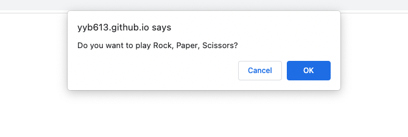

# Rock, Paper, Scissors Game

## Description
This is a simple Rock, Paper, Scissors game that is played by entering R, P, or S in user prompts to choose your object. The computer chooses an object in return and win/loss stats are displayed at the end of each round.

## Deployment
[Deployment Link](https://yyb613.github.io/rock-paper-scissors)

## License

  
This project is licensed under the MIT License.

For more information on this license, please visit [their website](https://www.mit.edu/~amini/LICENSE.md).

## Contact
If you have any questions, you can find me [here](https://yyb613.github.io/portfolio).
